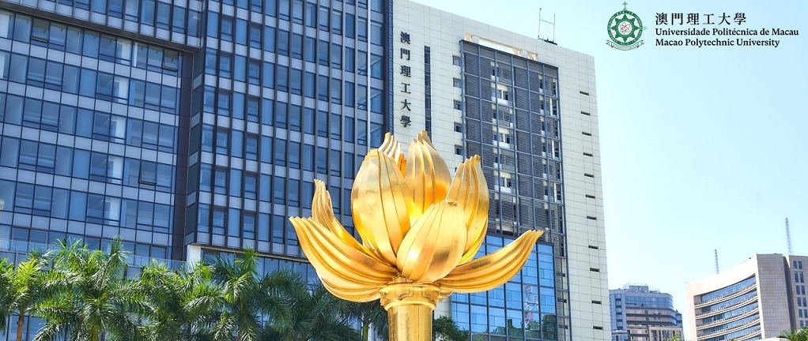

# XrayGLM

 <p align="center">
      <a href='https://github.com/WangRongsheng/XrayGLM'>
            
      </a>
      <a href='https://github.com/WangRongsheng/XrayGLM'>
            
      </a>
      <a href='https://github.com/WangRongsheng/XrayGLM'>
            
      </a>
      <a href="https://github.com/WangRongsheng/XrayGLM">
        
      </a>
      <a href="https://github.com/WangRongsheng/XrayGLM/blob/main/LICENSE">
        
      </a>
      </br>
      <a href="https://github.com/WangRongsheng/XrayGLM/graphs/contributors">
        
      </a>
      <a href="https://github.com/WangRongsheng/XrayGLM/issues">
        
      </a>
      <a href="https://github.com/WangRongsheng/XrayGLM/pulls">
        
      </a>
      <a href=href="https://github.com/kaixindelele/XrayGLM/stargazers">
        
      </a>
  </p>

# 项目致谢

1. [VisualGLM-6B](https://github.com/THUDM/VisualGLM-6B)为我们提供了基础的代码参考和实现；
2. [MiniGPT-4](https://github.com/Vision-CAIR/MiniGPT-4)和[XrayGPT](https://github.com/mbzuai-oryx/XrayGPT)为我们这个项目提供了研发思路；
3. ChatGPT生成了高质量的中文版X光检查报告以支持XrayGLM训练；
4. [gpt_academic](https://github.com/binary-husky/gpt_academic)为文档翻译提供了多线程加速；



这项工作由[澳门理工大学应用科学学院](https://www.mpu.edu.mo/esca/zh/index.php)硕士生[王荣胜](https://github.com/WangRongsheng) 、[段耀菲](https://github.com/IsBaSO4) 、[李俊蓉](https://github.com/lijunrong0815)完成，同时这项工作受到[檀韬](https://scholar.google.com/citations?hl=zh-CN&user=lLg3WRkAAAAJ)副教授、[彭祥佑](http://www.patrickpang.net/)老师的帮助支持。

*特别鸣谢：[USTC-PhD Yongle Luo](https://github.com/kaixindelele) 提供了有3000美金的OpenAI账号，帮助我们完成大量的X光报告翻译工作

# 免责声明

本项目相关资源仅供学术研究之用，严禁用于商业用途。使用涉及第三方代码的部分时，请严格遵循相应的开源协议。模型生成的内容受模型计算、随机性和量化精度损失等因素影响，本项目无法对其准确性作出保证。即使本项目模型输出符合医学事实，也不能被用作实际医学诊断的依据。对于模型输出的任何内容，本项目不承担任何法律责任，亦不对因使用相关资源和输出结果而可能产生的任何损失承担责任。

# 项目引用

如果你使用了本项目的模型，数据或者代码，请声明引用：

```bash
@misc{wang2023XrayGLM,
      title={XrayGLM: The first Chinese Medical Multimodal Model that Chest Radiographs Summarization}, 
      author={Rongsheng Wang, Yaofei Duan, Junrong Li, Patrick Pang and Tao Tan},
      year={2023},
      publisher = {GitHub},
      journal = {GitHub repository},
      howpublished = {\url{https://github.com/WangRongsheng/XrayGLM}},
}
```

# 使用许可

此存储库遵循[CC BY-NC-SA](https://creativecommons.org/licenses/by-nc-sa/4.0/) ，请参阅许可条款。

